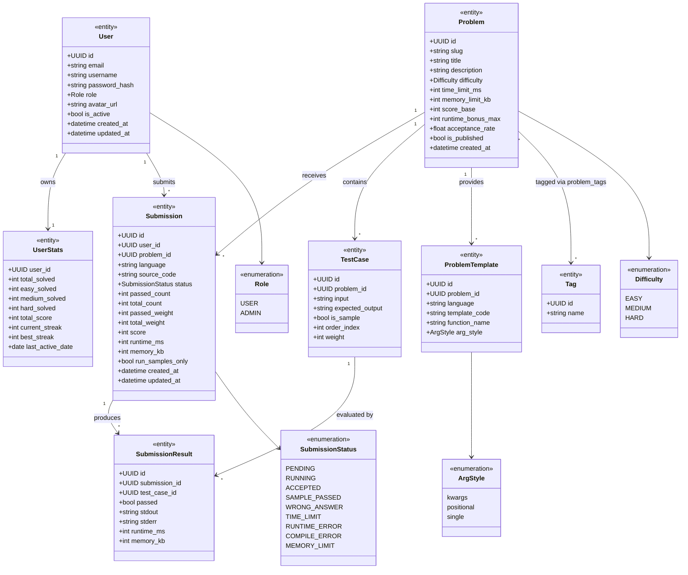
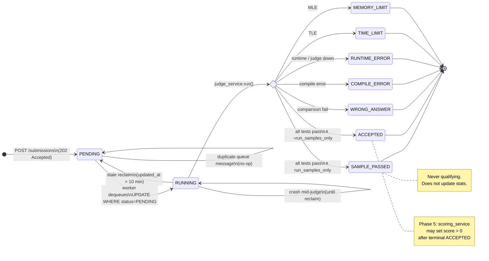
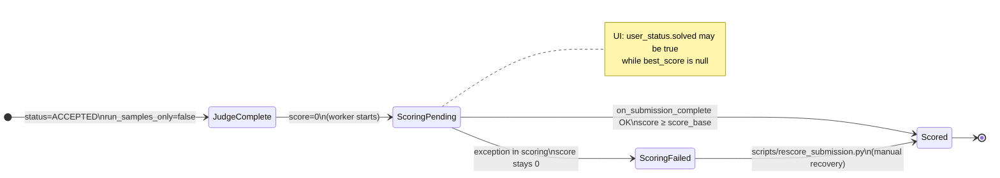
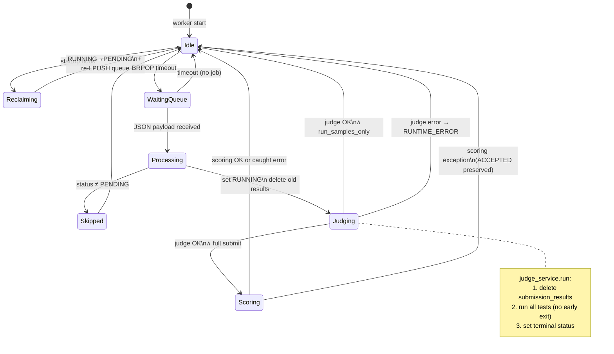
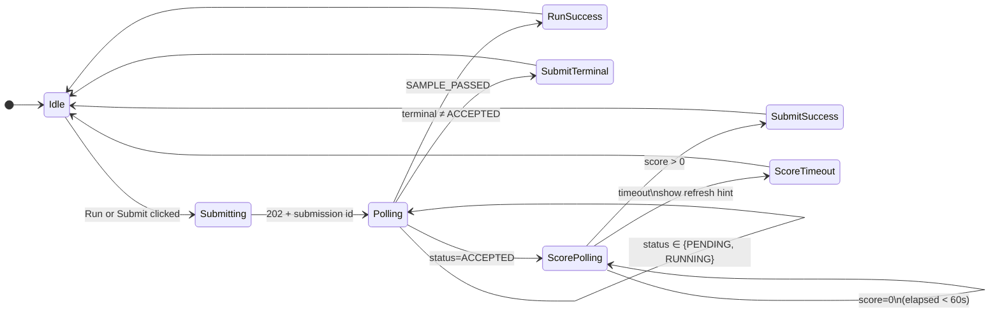
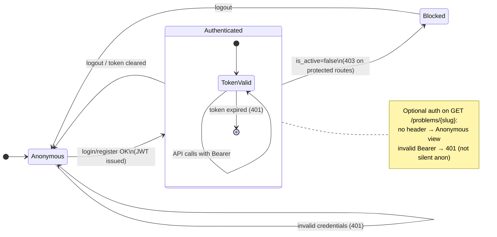

# UML Specification — XYZ Platform (v1)

Formal **class** and **state** diagrams for architecture review and implementation. Notation: [Mermaid](https://mermaid.js.org/) (renders on GitHub and most Markdown viewers).

**Related:** [../backend/01-database-models.md](../backend/01-database-models.md) · [../backend/08-controllers-services.md](../backend/08-controllers-services.md) · [../backend/05-phase-4-judge.md](../backend/05-phase-4-judge.md)

---

## 1. Domain model — class diagram

Persistent entities and cardinalities. Enums shown as `«enumeration»`.



**Qualifying submission (derived rule, not a column):**  
`status = ACCEPTED ∧ run_samples_only = false`

---

## 2. Application layer — class diagram

HTTP adapters, domain services, and persistence. Dependency direction: Router → Controller → Service → Repository.

```mermaid
classDiagram
    direction TB

    namespace HTTP {
        class AuthRouter
        class ProblemsRouter
        class SubmissionsRouter
        class AdminRouter
        class LeaderboardRouter
    }

    namespace Controllers {
        class AuthController {
            +register()
            +login()
        }
        class ProblemController {
            +list_problems()
            +get_problem()
            +get_best_submission()
        }
        class SubmissionController {
            +create_submission()
            +get_submission()
            +get_results()
        }
        class AdminProblemController {
            +create()
            +update()
            +unpublish()
            +add_test_cases()
        }
        class LeaderboardController {
            +get_leaderboard()
        }
    }

    namespace Services {
        class AuthService {
            +register()
            +login()
        }
        class ProblemService {
            +list_filtered()
            +get_by_slug()
            +get_best_submission()
        }
        class SubmissionService {
            +create()
            +enqueue()
        }
        class JudgeService {
            +run()
        }
        class ScoringService {
            +on_submission_complete()
            +calculate_score()
        }
        class CodeWrapperService {
            +wrap()
        }
        class OutputCompareService {
            +compare()
        }
        class Judge0Client {
            +execute()
        }
        class LeaderboardService {
            +get_all_time()
            +get_weekly()
        }
        class RateLimitService {
            +check_ip()
            +check_submit()
        }
    }

    namespace Repositories {
        class UserRepo
        class ProblemRepo
        class SubmissionRepo
        class SubmissionResultRepo
        class UserStatsRepo
        class TagRepo
    }

    namespace Worker {
        class SubmissionWorker {
            +process_submission()
            +reclaim_stale_running()
        }
    }

    AuthRouter --> AuthController
    ProblemsRouter --> ProblemController
    SubmissionsRouter --> SubmissionController
    AdminRouter --> AdminProblemController
    LeaderboardRouter --> LeaderboardController

    AuthController --> AuthService
    ProblemController --> ProblemService
    SubmissionController --> SubmissionService
    AdminProblemController --> ProblemService
    LeaderboardController --> LeaderboardService

    AuthService --> UserRepo
    AuthService --> UserStatsRepo
    ProblemService --> ProblemRepo
    ProblemService --> SubmissionRepo
    SubmissionService --> SubmissionRepo
    SubmissionService --> RateLimitService
    JudgeService --> SubmissionRepo
    JudgeService --> SubmissionResultRepo
    JudgeService --> Judge0Client
    JudgeService --> CodeWrapperService
    JudgeService --> OutputCompareService
    ScoringService --> SubmissionRepo
    ScoringService --> UserStatsRepo
    LeaderboardService --> UserStatsRepo

    SubmissionWorker --> SubmissionRepo
    SubmissionWorker --> JudgeService
    SubmissionWorker --> ScoringService : Phase 5+
```



---

## 3. Submission lifecycle — state diagram

Terminal states are shown with `[*]`. `SAMPLE_PASSED` applies only when `run_samples_only = true`.



---

## 4. Scoring sub-state (qualifying submissions only)

After judge sets `ACCEPTED` and `run_samples_only = false`, scoring runs in the worker (Phase 5).



---

## 5. Worker job processing — state diagram

One submission row per job. v1: single worker replica.



---

## 6. Client poll flow — state diagram (frontend)

Solve page behavior per [../backend/11-phase-6-frontend.md](../backend/11-phase-6-frontend.md).



---

## 7. Authentication — state diagram



---

## 8. Entity-relationship diagram

Logical schema (PostgreSQL). `problem_tags` is associative.

```mermaid
erDiagram
    USERS ||--o| USER_STATS : has
    USERS ||--o{ SUBMISSIONS : submits
    PROBLEMS ||--o{ SUBMISSIONS : receives
    PROBLEMS ||--o{ TEST_CASES : contains
    PROBLEMS ||--o{ PROBLEM_TEMPLATES : has
    PROBLEMS ||--o{ PROBLEM_TAGS : links
    TAGS ||--o{ PROBLEM_TAGS : links
    SUBMISSIONS ||--o{ SUBMISSION_RESULTS : yields
    TEST_CASES ||--o{ SUBMISSION_RESULTS : for

    USERS {
        uuid id PK
        string email UK
        string username UK
        enum role
        bool is_active
    }

    USER_STATS {
        uuid user_id PK_FK
        int total_solved
        int total_score
    }

    PROBLEMS {
        uuid id PK
        string slug UK
        enum difficulty
        bool is_published
        float acceptance_rate
    }

    SUBMISSIONS {
        uuid id PK
        uuid user_id FK
        uuid problem_id FK
        enum status
        int score
        bool run_samples_only
    }

    SUBMISSION_RESULTS {
        uuid id PK
        uuid submission_id FK
        uuid test_case_id FK
    }
```

---

## Diagram index

| § | Diagram | Type | Primary audience |
|---|---------|------|------------------|
| 1 | Domain model | Class | DB / backend devs |
| 2 | Application layer | Class | Backend devs |
| 3 | Submission lifecycle | State | Backend + frontend |
| 4 | Scoring sub-state | State | Backend + ops |
| 5 | Worker job processing | State | Backend / DevOps |
| 6 | Client poll flow | State | Frontend |
| 7 | Authentication | State | Full stack |
| 8 | Entity-relationship | ER | DB / migrations |

---

## Maintenance

When schema or worker behavior changes, update this file **and** the relevant phase doc, then add a row to [../backend/13-plan-verification.md](../backend/13-plan-verification.md).
